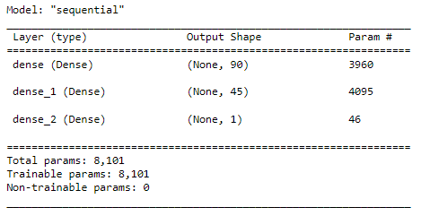
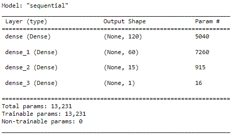
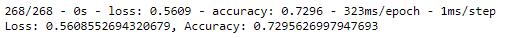

# Neural_Network_Charity_Analysis

## Overview of analysis

The goal of this project is to use neural networks in order to create a binary classifier that can determine whether a charity would be successful in achieving their goal if funded.

### Purpose

In this project data regarding charities and their application types were manipulated into a dataframe. Columns with irrelevant data was dropped, and the unique values for each column was analyzed. After looking at the unique values it 
was determined that it was likely that the application type and classification had a significant number, and that due to the fact that the data is not numerical it might be able to be binned effectively. The application type was reduced
from 17 unique values to 9 and the classification type was reduced from 71 unique values to 6. Next the categorical data was transformed using the scikit learn OneHotEncoder and merged with the original dataframe. The old categorical data
was also dropped from the dataframe. Then the target was determined to be the IS_SUCCESSFUL column and all other values were considered to be features. The data was then split and scaled. Finally a neural network with two hidden layers was 
created and the model was run. 

## Results

Data Preprocessing

1. What variable(s) are considered the target(s) for your model?

* The IS_SUCCESSFUL  column was determined to be the target because the goal is to determine given the data we received can a model be made to see whether the charity will achieve their goals.

2. What variable(s) are considered to be the features for your model?

* There are 8 variables that are considered to be features in this analysis. They include affiliation, classification, use case, organization, status, income amount, and ask amount.  

3. What variable(s) are neither targets nor features, and should be removed from the input data?

* The EIN and Name columns were neither targets nor features. They provide no useful data for the model and must be removed.

Compiling, Training, and Evaluating the Model

1.How many neurons, layers, and activation functions did you select for your neural network model, and why?

* In the initial neural network I used two hidden layers with the ReLU function and used 90 neurons in the first hidden layer and 45 in the second hidden layer as seen below.

In the first attempt for the first hidden layer I used a rule of thumb of 2 times the number of neurons as features input into the function. The second hidden layer was decided to have half of the number of neurons as the first layer. The
ReLu function was used because it tends to be proficient at looking at positive nonlinear input data for classification.

* In the initial neural network I used two hidden layers with the ReLU function and used 120 neurons in the first hidden layer, 60 in the second hidden layer as seen below and added a third layer with 15 neurons.

* I increased the number of neurons in the first two layers to attempt to increase the accuracy of the model. I was unable to improve the model overall a significant amount, but did receive higher accuracy values in individual epochs.

2.Were you able to achieve the target model performance?

* Unfortunately even after attempted optimization I was unable to meet an accuracy of 75%.

3.What steps did you take to try and increase model performance?

* First, I attempted to improve the model by binning the income amounts for the charities. I figured that it would be likely that charities that already have an income above $1 Million would be far more likely to meet their goals than 
charities that were not as well funded. I decided as a result to group all of these charities together because the model would consider these to be belonging to the category of the range rather than an analog value removing this information
I thought might potentially simplify this portion of the model. This produced worse results than the original model. Next I tried doubling the number of neurons in the first hidden layer and increasing the number of neurons in the second
hidden layer. A third hidden layer was also added with 15 neurons. This improved the model slightly. the overall accuracy remained roughly the same but some individual epochs increased their accuracy to values not found in the previous model.
Next I dropped the column "Special Considerations" because it seemed to not be particularly valuable to the end goal of whether a charity would succeed. I was correct that this was not particularly relevant as the accuracy did not drop markedly,
but it did not improve either.

## Summary

Overall the model was decent at predicting whether the a charity would accomplish their goal with an accuracy of roughly 73%, but the results could be further improved. Below is the results of the model:

If a different model was to be chosen I would have chosen to use a random forest classifier. These classifiers are better at ensuring against over fitting, and tend to be able to run well on both linear and nonlinear data sets. At worst
information on feature importance would be provided, which would allow us to know if any columns should be dropped or manipulated in our neural network to provide better results.  

